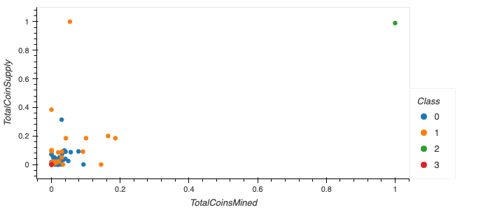

# Unsupervised Machine learning Cryptocurrencies

## Overview:

The analysis involves preprocessing the data, using PCA to reduce dimensions, clustering with the K-Means algorithm and creating visualizations with hvplot.

</img>